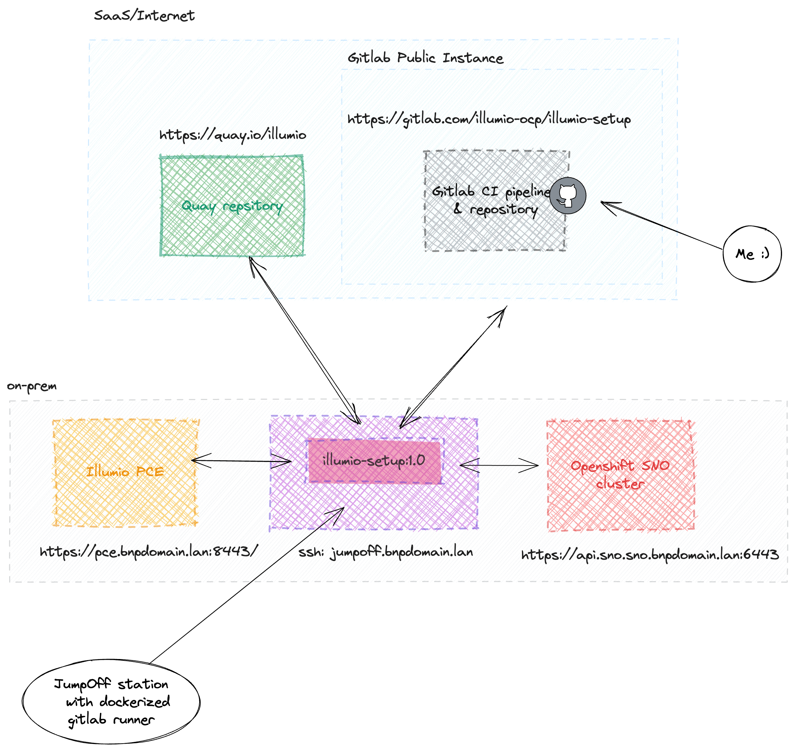

### Welcome to ApiusLAB

In this guide, we walk you through building and deploying a GitLab CI pipeline to install Illumio Core components (Kubelink & C-VEN) on **vanilla Kubernetes** clusters using **CLAS mode** (Cluster Local Actor Store).

# GitLab CI Pipeline for Illumio Core on Kubernetes

## Architecture

The pipeline deploys Illumio Core for Kubernetes (Helm chart **5.9.0**) in **CLAS mode**, which provides:

- **Degraded mode** — cached policies survive PCE outages (via local etcd)
- **Wait for Policy** — pods don't start until segmentation policy is applied
- **Label-set optimization** — PCE groups policies by labels, reducing policy size
- **Kubernetes Workload management** — PCE manages aggregated workloads, not individual pods

Components deployed:
- **Kubelink** (Deployment, 1 replica) — cluster integration, communicates with PCE API
- **C-VEN** (DaemonSet, every node) — enforcement agent, manages iptables/nftables rules
- **Storage** (StatefulSet, etcd) — local policy cache for CLAS mode

## Prerequisites

### 1. Runner Image

Build the custom runner image from the `Dockerfile` in this repo:

```bash
docker build -t registry.gitlab.com/illumio-k8s/illumio-setup:2.0 .
docker push registry.gitlab.com/illumio-k8s/illumio-setup:2.0
```

The image contains: `kubectl`, `helm`, `python3` (with `yaml` and `requests` modules).

To test locally:
```bash
docker run --rm -it registry.gitlab.com/illumio-k8s/illumio-setup:2.0 bash
kubectl version --client
helm version
```

### 2. GitLab CI/CD Variables

Collect the following from your Illumio PCE administrator and Kubernetes cluster admin, then configure as GitLab CI/CD Variables:

**Illumio PCE credentials:**

| Variable | Type | Example | Description |
|----------|------|---------|-------------|
| `ILLUMIO_API_URL` | Variable | `pce.example.com:8443` | PCE API endpoint |
| `ILLUMIO_API_USERNAME` | Variable | `api_1257c00ddf548ff92` | API key ID |
| `ILLUMIO_API_SECRET` | Variable (masked) | `9664ee610e5b...` | API secret |
| `ILLUMIO_ORG` | Variable | `1` | Organization ID |
| `ILLUMIO_PP_ID` | Variable | `14` | Pairing Profile ID |

**Kubernetes cluster access:**

| Variable | Type | Example | Description |
|----------|------|---------|-------------|
| `KUBECONFIG_FILE` | **File** | *(kubeconfig contents)* | Full kubeconfig for target cluster |

**Optional — Private CA certificates:**

| Variable | Type | Description |
|----------|------|-------------|
| `BUNDLE_CA_CRT` | **File** | Root CA + PCE certificate chain (PEM). When provided, the pipeline automatically creates a ConfigMap and mounts it into C-VEN/Kubelink pods at `/etc/pki/tls/ilo_certs/` |

## Pipeline Stages

The pipeline has **4 stages**:

```
Stage 1: build_cc    → Create Container Cluster + Pairing Profile in PCE (REST API)
Stage 2: build_hc    → Pull Helm chart, customize values.yaml (CLAS, K8s, credentials)
Stage 3: deploy      → kubectl + helm install to target cluster
Stage 4: remove      → Manual: helm uninstall + cleanup PCE (manual trigger)
```

All stages use the custom runner image and execute on the `jumpoff` tagged runner.

<p align=center>

</p>

### Stage 1: build_container_cluster

Interacts with the Illumio PCE via REST API:
1. `cc.py create` — creates a Container Cluster definition, outputs cluster token and href
2. `pp.py create` — generates a one-time Pairing Profile Activation Code (PPAC)

Artifacts are stored in the `build/` directory for subsequent stages.

### Stage 2: build_helm_chart

1. Pulls the Illumio Helm chart from `oci://quay.io/illumio/illumio` (version 5.9.0)
2. Fixes manifests: adds imagePullSecrets, CPU resource limits
3. Extracts container image info via `extract.py`
4. Customizes `values.yaml` with:
   - PCE credentials (URL, cluster ID, token, PPAC)
   - `containerRuntime: containerd` / `containerManager: kubernetes`
   - `clusterMode: clas` (CLAS mode)
   - Private CA certificate config (if provided)

**No image mirroring** — clusters pull directly from `quay.io/illumio`.

### Stage 3: deploy_illumio

1. Authenticates to the K8s cluster via `KUBECONFIG_FILE`
2. Creates `illumio-system` namespace (name is mandatory)
3. Creates ConfigMap with CA certificates (if provided)
4. Runs `helm install` with the customized values
5. Verifies: checks pod status, Kubelink logs, C-VEN logs, CLAS storage status

Expected success indicator in C-VEN logs:
```
VEN has been SUCCESSFULLY paired with Illumio
```

### Stage 4: remove_illumio (manual)

Triggered manually for cleanup:
1. `helm uninstall` — triggers C-VEN unpairing from PCE
2. Waits 60s for unpair jobs to complete
3. Deletes `illumio-system` namespace
4. Removes Container Cluster definition from PCE via `cc.py delete`

## Configuration Options

Key variables in `.gitlab-ci.yml`:

| Variable | Default | Description |
|----------|---------|-------------|
| `ILLUMIO_QUAY_TAG` | `5.9.0` | Helm chart version |
| `CLUSTER_MODE` | `clas` | Deployment mode: `clas`, `legacy`, `migrateLegacyToClas` |
| `CONTAINER_RUNTIME` | `containerd` | Runtime: `containerd`, `crio`, `k3s_containerd` |
| `CONTAINER_MANAGER` | `kubernetes` | Platform: `kubernetes`, `openshift` |

## Files

| File | Description |
|------|-------------|
| `.gitlab-ci.yml` | Pipeline definition (4 stages) |
| `Dockerfile` | Custom runner image (kubectl + helm + python3) |
| `cc.py` | Container Cluster CRUD via PCE REST API |
| `pp.py` | Pairing Profile key generation via PCE REST API |
| `extract.py` | Extracts container image info from Helm values.yaml |
| `add_imagePullSecret.py` | Injects imagePullSecrets into unpair job manifest |
| `add_resources_limits.py` | Adds CPU limits to Kubelink, C-VEN, and Storage manifests |

## Migration from OpenShift

This pipeline was migrated from an OpenShift-based version. Key changes:
- `oc` → `kubectl` (kubeconfig file auth instead of `oc login`)
- `containerManager: openshift` → `kubernetes`
- `containerRuntime: crio` → `containerd`
- Helm chart: 4.3.0 → **5.9.0** with **CLAS mode**
- Removed Docker-in-Docker image mirroring stage (direct pull from quay.io)
- Added CLAS etcd storage support

### Thank You:
- Illumio [illumio.com](https://illumio.com)
- Apius Technologies [apius.pl](https://apius.pl)

🐳 + ☸️ 2026 Marek Plaza
